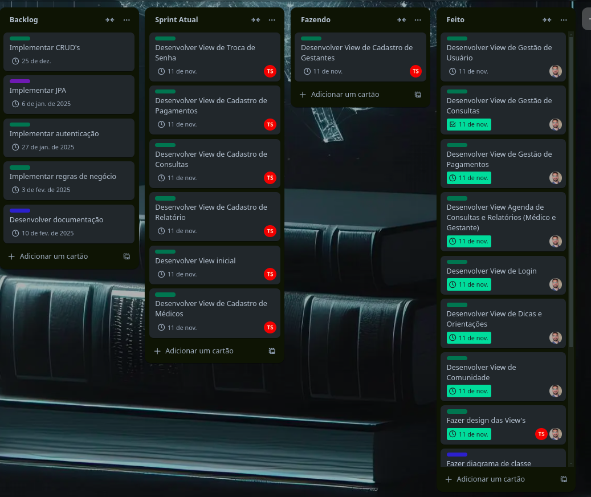
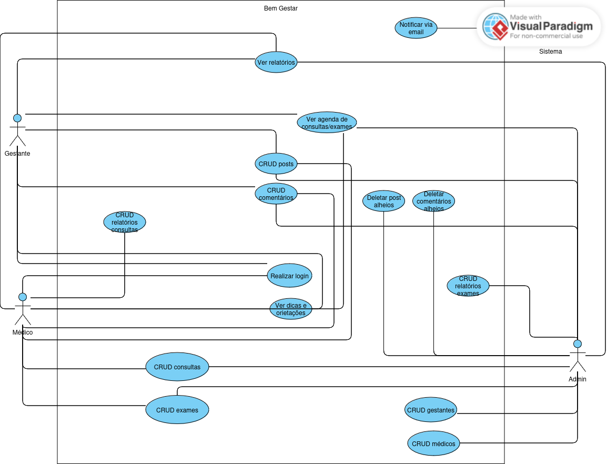
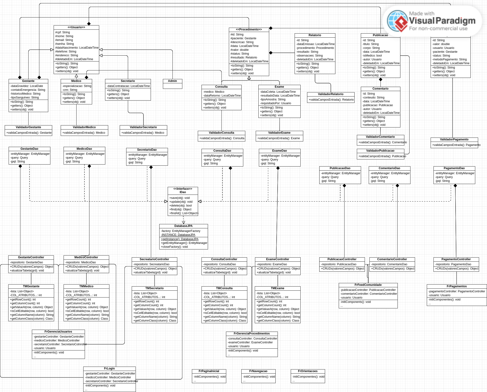

# BemGestar

## Índice
1. [Introdução](#introdução)
2. [Modelagem](#modelagem)
    - [Quadro Scrum](#quadro-scrum)
    - [Diagrama de Casos de Uso](#diagrama-de-casos-de-uso)
    - [Diagrama de Classes](#diagrama-de-classes)
3. [Tecnologias Utilizadas](#tecnologias-utilizadas)
4. [Instalação](#instalação)
5. [Uso](#uso)

## Introdução

O BemGestar é um sistema desenvolvido para clínicas acompanharem e auxiliarem gestantes durante o período de pré-natal. O sistema oferece uma plataforma completa para o gerenciamento de informações de saúde e suporte durante a gestação. Com o objetivo de facilitar o acompanhamento médico e proporcionar uma experiência mais segura e organizada, o sistema permite o cadastro e gerenciamento de gestantes, consultas e exames.

Além disso, o BemGestar oferece uma comunidade de apoio, onde as gestantes podem trocar experiências, receber dicas e acessar informações importantes sobre o processo gestacional. O sistema conta também com diferentes níveis de permissão para garantir a segurança dos dados, com acesso protegido por login e senha. Relatórios detalhados de exames e procedimentos podem ser facilmente gerados, auxiliando tanto gestantes quanto profissionais de saúde no acompanhamento do pré-natal.

## Modelagem

### Quadro Scrum

O desenvolvimento do BemGestar segue a metodologia ágil Scrum, permitindo um gerenciamento eficiente do projeto através de sprints, priorização de tarefas e acompanhamento contínuo do progresso. O quadro de tarefas está organizado no Trello, onde é possível visualizar o backlog, as sprints em andamento e as tarefas concluídas. Essa abordagem garante uma entrega incremental e adaptável, focada na evolução contínua do sistema.

*Atualizado em 25/10/2024

### Diagrama de Casos de Uso

O Diagrama de Casos de Uso do BemGestar apresenta as principais interações entre os usuários e o sistema, ilustrando de forma clara os diferentes cenários de uso e as funcionalidades disponíveis. Através desse diagrama, é possível visualizar como gestantes, profissionais de saúde e administradores interagem com o sistema, desde o cadastro de gestantes até o acesso aos relatórios e à comunidade de apoio. Essa representação gráfica auxilia no entendimento do fluxo de operações e no planejamento das funcionalidades do sistema.

### Diagrama de Classes

A seção de Diagrama de Classes do BemGestar apresenta a estrutura de classes que compõem o sistema, detalhando as relações entre os diferentes tipos de usuários (como gestantes, médicos e administradores) e os principais componentes do sistema. Este diagrama demonstra a hierarquia de herança e a organização das classes, ilustrando como cada uma delas interage para possibilitar funcionalidades como gerenciamento de contas, registro de consultas e geração de relatórios. Essa visão estrutural do sistema facilita o entendimento do modelo de dados e da lógica de negócio por trás do BemGestar.

## Tecnologias Utilizadas

## Instalação

## Uso
