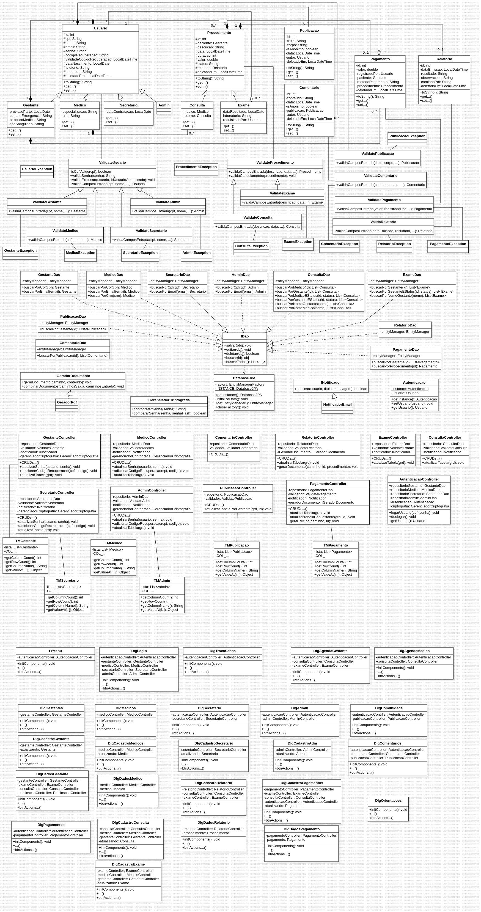
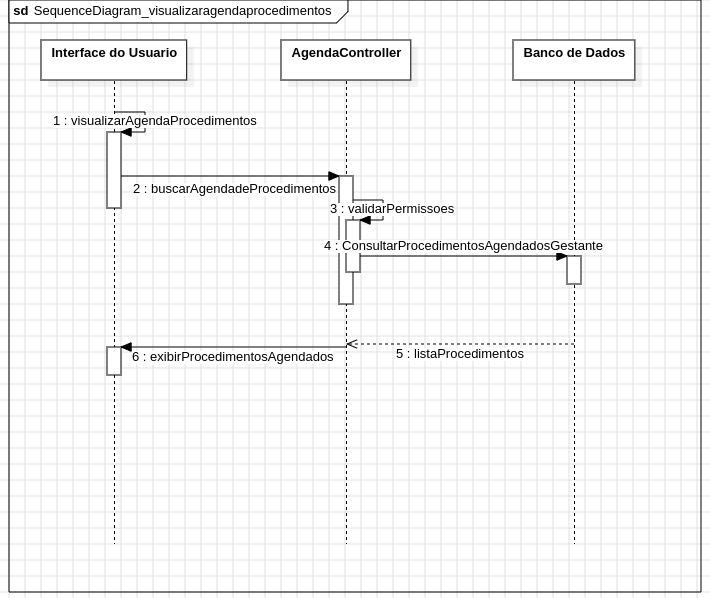

# BemGestar

## Índice
1. [Introdução](#introdução)
2. [Modelagem](#modelagem)
    - [Quadro Scrum](#quadro-scrum)
    - [Diagrama de Casos de Uso](#diagrama-de-casos-de-uso)
    - [Diagrama de Classes](#diagrama-de-classes)
    - [Diagrama Entidade Relacionamento](#diagrama-entidade-relacionamento)
    - [Diagramas de Sequência](#diagramas-de-sequência)
3. [Tecnologias Utilizadas](#tecnologias-utilizadas)
4. [Instalação](#instalação)
5. [Primeiro Login](#primeiro-login)

## Introdução

O BemGestar é um sistema desenvolvido para clínicas acompanharem e auxiliarem gestantes durante o período de pré-natal. O sistema oferece uma plataforma completa para o gerenciamento de informações de saúde e suporte durante a gestação. Com o objetivo de facilitar o acompanhamento médico e proporcionar uma experiência mais segura e organizada, o sistema permite o cadastro e gerenciamento de gestantes, consultas e exames.

Além disso, o BemGestar oferece uma comunidade de apoio, onde as gestantes podem trocar experiências, receber dicas e acessar informações importantes sobre o processo gestacional. O sistema conta também com diferentes níveis de permissão para garantir a segurança dos dados, com acesso protegido por login e senha. Relatórios detalhados de exames e procedimentos podem ser facilmente gerados, auxiliando tanto gestantes quanto profissionais de saúde no acompanhamento do pré-natal.

## Modelagem

### Quadro Scrum

O desenvolvimento do BemGestar segue a metodologia ágil Scrum, permitindo um gerenciamento eficiente do projeto através de sprints, priorização de tarefas e acompanhamento contínuo do progresso. O quadro de tarefas está organizado no Trello, onde é possível visualizar o backlog, as sprints em andamento e as tarefas concluídas. Essa abordagem garante uma entrega incremental e adaptável, focada na evolução contínua do sistema. O quadro pode ser acessado [aqui](https://trello.com/invite/b/670e74754ad3442f24634e35/ATTIdc5159a42914a0ad99b494a518cd1b0bA314F45A/2024-12-13-tcc).

### Diagrama de Casos de Uso

O Diagrama de Casos de Uso do BemGestar apresenta as principais interações entre os usuários e o sistema, ilustrando de forma clara os diferentes cenários de uso e as funcionalidades disponíveis. Através desse diagrama, é possível visualizar como gestantes, profissionais de saúde e administradores interagem com o sistema, desde o cadastro de gestantes até o acesso aos relatórios e à comunidade de apoio. Essa representação gráfica auxilia no entendimento do fluxo de operações e no planejamento das funcionalidades do sistema.


### Diagrama de Classes

A seção de Diagrama de Classes do BemGestar apresenta a estrutura de classes que compõem o sistema, detalhando as relações entre os diferentes tipos de usuários (como gestantes, médicos e administradores) e os principais componentes do sistema. Este diagrama demonstra a hierarquia de herança e a organização das classes, ilustrando como cada uma delas interage para possibilitar funcionalidades como gerenciamento de contas, registro de consultas e geração de relatórios. Essa visão estrutural do sistema facilita o entendimento do modelo de dados e da lógica de negócio por trás do BemGestar.



### Diagrama Entidade Relacionamento

O Diagrama Entidade Relacionamento (DER) do BemGestar representa a estrutura do banco de dados do sistema, ilustrando as entidades, seus atributos e os relacionamentos entre elas. Este diagrama é fundamental para entender como os dados são organizados e armazenados, mostrando a estrutura das tabelas que suportam funcionalidades como cadastro de usuários, agendamento de consultas, registro de exames e gerenciamento da comunidade.


### Diagramas de Sequência

Abaixo estão os diagramas de sequência principais do BemGestar, que ilustram o fluxo detalhado de algumas interações fundamentais no sistema. Esses diagramas ajudam a entender como o sistema gerencia os processos de criação de contas e visualização de agenda, evidenciando a comunicação entre diferentes componentes.

#### 1. Criação de Conta de Gestante
Este diagrama detalha o processo de criação de conta para uma gestante, mostrando como o sistema valida e armazena as informações de cadastro.


#### 2. Criação de Conta de Médico
Este diagrama ilustra o fluxo para criação de uma conta de médico, incluindo as validações necessárias e o armazenamento de dados de acesso.


#### 3. Visualização da Agenda
Este diagrama descreve o processo de visualização da agenda de procedimentos da clínica, incluindo a interação do usuário, podendo ser um médico, gestante ou a secretária, com o sistema e a exibição dos processedimentos agendados.




## Tecnologias Utilizadas

O BemGestar foi desenvolvido utilizando as seguintes tecnologias:

### Desenvolvimento
- **Java**: Linguagem de programação principal, escolhida por sua robustez e amplo suporte
- **SQLite**: Banco de dados relacional leve e de fácil integração
- **Hibernate**: Framework ORM para mapeamento objeto-relacional
- **Lombok**: Biblioteca para redução de código boilerplate
- **JavaMail**: API para envio de emails e notificações
- **iTextPDF**: Biblioteca para geração de documentos PDF
- **BCrypt**: Biblioteca para criptografia segura de senhas
- **Swing**: Framework para desenvolvimento da interface gráfica desktop

### Ferramentas
- **Maven**: Gerenciamento de dependências e build do projeto
- **Git**: Controle de versão do código fonte
- **GitHub**: Plataforma para hospedagem e colaboração do código

### Documentação e Modelagem
- **StarUML**: Ferramenta para criação dos diagramas UML
- **Trello**: Gerenciamento ágil do projeto usando Scrum

A escolha dessas tecnologias foi baseada na necessidade de criar uma aplicação desktop robusta e confiável, com foco na facilidade de manutenção e segurança. O Java com Swing oferece uma solução completa para interfaces desktop, enquanto o SQLite proporciona um banco de dados leve e eficiente. A segurança dos dados é garantida através do BCrypt para criptografia de senhas, e a geração de documentos é facilitada pelo iTextPDF.

## Instalação

Para executar o BemGestar, você precisa ter os seguintes pré-requisitos instalados em seu sistema:

### Pré-requisitos

1. **Java Development Kit (JDK) 17 ou superior**
   - Faça o download e instale o JDK através do [site oficial da Oracle](https://www.oracle.com/java/technologies/downloads/)
   - Verifique a instalação executando no terminal:
     ```
     java -version
     ```

2. **Apache Maven**
   - No Linux, você pode instalar via apt:
     ```
     sudo apt update
     sudo apt install maven
     ```
   - Alternativamente, faça o download do Maven através do [site oficial](https://maven.apache.org/download.cgi)
   - Configure as variáveis de ambiente conforme a [documentação](https://maven.apache.org/install.html)
   - Verifique a instalação executando no terminal:
     ```
     mvn -version
     ```
3. **Senha de App do Gmail**
   - Para enviar emails através da aplicação, é necessário configurar uma Senha de App do Gmail
   - Para mais detalhes, consulte a [documentação oficial do Google](https://support.google.com/mail/answer/185833?hl=pt-BR).

### Passos para Instalação

1. Clone o repositório:
   ```
   git clone https://github.com/CantarinoG/plataforma-gestantes.git
   ```

2. Navegue até o diretório do projeto.

3. Crie o arquivo `Secrets.java` no diretório `src/main/java/com/cantarino/souza/model/services/` com o seguinte conteúdo:
   ```java
   package com.cantarino.souza.model.services;

   public class Secrets {
       public static String GMAIL_KEY = "sua_senha_de_app_do_gmail_aqui";
   }
   ```
   Substitua "sua_senha_de_app_do_gmail_aqui" pela senha de app do Gmail obtida no passo 3 dos pré-requisitos.

4. Compile o projeto usando Maven:
   ```
   mvn clean install
   ```

5. Execute o projeto usando Maven:
    ```
    mvn exec:java
    ```
## Primeiro Login

Ao instalar a aplicação, é criado automaticamente um usuário administrador com as seguintes credenciais:
- CPF: 000.000.000-00
- Senha: 000000

Após realizar o primeiro login com essas credenciais, é recomendado que você altere a senha deste usuário por questões de segurança. Com este usuário administrador, você poderá criar novos usuários e começar a utilizar todas as funcionalidades do sistema normalmente.